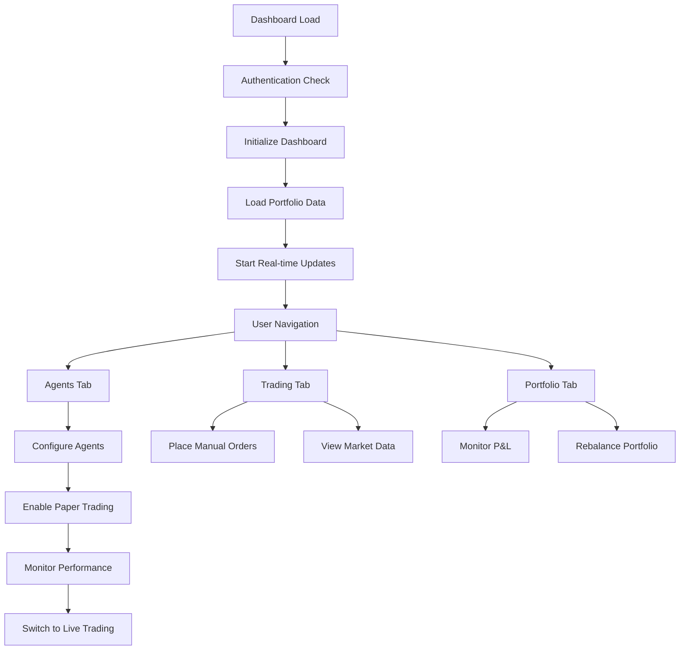
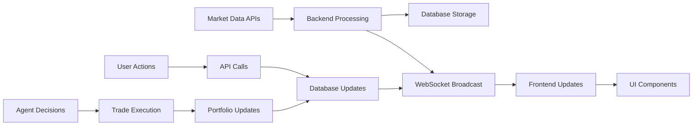
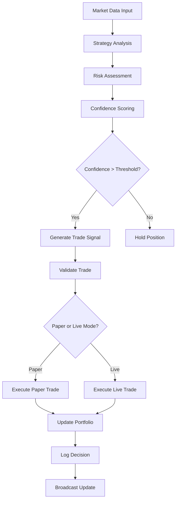
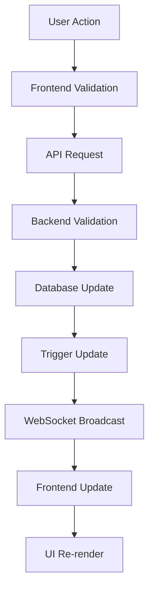

# Cival Dashboard - Application Flow Documentation

## 🌊 User Journey & Application Flow

### Primary User Flow: From Dashboard to Live Trading



## 🎯 Navigation Structure & Flow

### 1. **Dashboard (Overview)**
**Purpose:** Central hub for portfolio monitoring and quick actions

**Flow:**
```
Load Dashboard → Fetch Portfolio Summary → Display Key Metrics → Real-time Updates
```

**Key Components:**
- Portfolio value and P&L display
- Active positions summary
- Agent status overview
- Quick action buttons for each section
- System health indicators

**API Calls:**
```typescript
// Initial load
GET /api/v1/portfolio/summary
GET /api/v1/agents/status
GET /api/v1/trading/overview
GET /health

// Real-time updates (WebSocket)
subscribe('portfolio_update')
subscribe('agent_status')
subscribe('market_data')
```

### 2. **Trading Tab**
**Purpose:** Live trading interface with market data and order placement

**Flow:**
```
Load Trading → Get Market Data → Display Order Book → Enable Order Placement → Monitor Executions
```

**Key Features:**
- Real-time price charts
- Order placement forms
- Position management
- Trade history
- Market data feeds

**User Actions:**
1. Select trading pair
2. Choose order type (Market/Limit/Stop)
3. Set quantity and price
4. Review and confirm order
5. Monitor execution status

### 3. **Agents Tab**
**Purpose:** AI agent management and monitoring

**Flow:**
```
Load Agents → Display Agent Cards → Configure Settings → Enable Trading → Monitor Decisions
```

**Agent Lifecycle:**
1. **Creation:** Set up agent with personality and strategies
2. **Configuration:** Define risk parameters and capital allocation
3. **Paper Trading:** Test strategies with virtual capital
4. **Performance Review:** Analyze results and metrics
5. **Live Trading:** Enable real capital trading
6. **Monitoring:** Track decisions and performance

**Key Components:**
- Agent status cards with enhanced separation
- Real-time decision log
- Performance metrics
- Configuration modals
- LLM connection status

### 4. **Farms Tab**
**Purpose:** Yield farming and DeFi strategy management

**Flow:**
```
Load Farms → Display Available Strategies → Select Farm → Configure Parameters → Deploy Capital
```

**Farm Management Process:**
1. Browse available yield farming opportunities
2. Analyze APY and risk metrics
3. Configure farming parameters
4. Deploy capital to farming contracts
5. Monitor yields and performance
6. Harvest rewards automatically

### 5. **Goals Tab**
**Purpose:** Strategic planning and target setting

**Flow:**
```
Load Goals → Create New Goal → Set Targets → Track Progress → Achieve/Adjust Goals
```

**Goal Types:**
- Profit targets (daily/weekly/monthly)
- Risk management objectives
- Portfolio diversification goals
- Agent performance benchmarks

### 6. **Vault Tab**
**Purpose:** Multi-chain wallet management and security

**Flow:**
```
Load Vaults → Connect Wallets → Display Balances → Cross-chain Operations → Security Management
```

**Wallet Operations:**
1. Connect external wallets
2. View multi-chain balances
3. Transfer between chains
4. Manage security settings
5. Monitor transaction history

### 7. **DeFi Tab**
**Purpose:** Decentralized finance protocol integration

**Flow:**
```
Load DeFi → Connect Protocols → Display Positions → Manage Lending/Borrowing → Monitor Yields
```

**DeFi Operations:**
1. Connect to protocols (Aave, Compound, etc.)
2. Lend assets for yield
3. Borrow against collateral
4. Manage liquidation risks
5. Optimize yield strategies

### 8. **Calendar Tab**
**Purpose:** Performance tracking and scheduling

**Flow:**
```
Load Calendar → Display Performance History → Schedule Events → Track Metrics → Generate Reports
```

**Calendar Features:**
- Daily P&L visualization
- Trading performance heatmap
- Scheduled rebalancing events
- Agent decision timeline
- Performance milestone tracking

### 9. **Advanced Tab**
**Purpose:** System administration and advanced features

**Flow:**
```
Load Advanced → Select Tool → Configure Settings → Execute Operations → Monitor Results
```

**Advanced Tools:**
- **Data Pipeline Management:** ETL processes and data sources
- **Eliza AI Hub:** Advanced AI model management
- **MCP Server Manager:** Model Context Protocol servers
- **Python Analysis Pipeline:** Custom script execution
- **Memory Analytics:** System memory optimization
- **System Monitoring:** Infrastructure health and performance

## 🔄 Data Flow Architecture

### Real-time Data Pipeline



### Component Communication Flow

```typescript
// Example: Agent Decision Flow
1. Agent analyzes market data
2. Agent makes decision (logged to database)
3. Decision triggers trade execution (if applicable)
4. Trade updates portfolio
5. Portfolio update broadcast via WebSocket
6. Frontend components re-render with new data
```

## 🎨 User Interface Flow

### Modal Dialog System
**Enhanced with proper backdrop and focus management**

```typescript
// Dialog Flow
Open Dialog → Apply Backdrop → Focus Management → User Interaction → Close Dialog → Restore Focus
```

**Button Enhancement:**
- High contrast colors for better visibility
- Distinct button variants (buy, sell, agent, warning, success, info)
- Proper hover and focus states
- Loading indicators for async operations

### File Upload Flow (Supabase Dropzone)

```
1. User drags/selects files
2. Validate file types and sizes
3. Upload to Supabase storage
4. Store metadata in database
5. Display upload progress
6. Mark files for agent ingestion
7. Process files for agent consumption
8. Update agent knowledge base
```

### Real-time Updates Flow

```typescript
// WebSocket Event Handling
WebSocket Message → Event Type Check → Component Update → State Management → UI Re-render

// Supported Events:
- portfolio_update: Live portfolio changes
- agent_decision: New agent decisions
- market_data: Price and volume updates
- trade_execution: Order fill notifications
- risk_alert: Risk management warnings
```

## 🤖 Agent Workflow

### Agent Decision Making Process



### Paper Trading Engine Flow

```typescript
// Paper Trading Process
1. Initialize agent account with $100 virtual capital
2. Agent generates trading signals
3. Validate orders against available balance
4. Execute trades with simulated slippage
5. Update portfolio positions
6. Calculate P&L and metrics
7. Log all transactions
8. Generate performance reports
```

### LLM Integration Flow

```typescript
// AI Decision Making
1. Collect market data and context
2. Format prompt for LLM
3. Send request to LLM provider (OpenAI/Anthropic/OpenRouter)
4. Parse LLM response
5. Extract trading signals and reasoning
6. Score confidence level
7. Execute actions based on confidence
8. Log decision with full reasoning
```

## 📊 Data Synchronization

### Database Update Flow



### Real-time Synchronization

```typescript
// Sync Strategy
1. Optimistic Updates: Update UI immediately
2. Server Confirmation: Validate with backend
3. Conflict Resolution: Handle server conflicts
4. Rollback: Revert if server rejects
5. Broadcast: Notify other clients
```

## 🔐 Security Flow

### Authentication Flow (Solo Operator Mode)

```
Application Start → Skip Authentication → Load Dashboard → Full Access
```

### API Security Flow

```
Request → Rate Limiting → Input Validation → Authorization Check → Process Request → Response
```

### File Upload Security

```
File Selection → Type Validation → Size Check → Virus Scan → Upload to Supabase → Metadata Storage
```

## 🚀 Performance Optimization Flow

### Loading Strategy

```typescript
// Progressive Loading
1. Show skeleton components immediately
2. Load critical data first (portfolio summary)
3. Load secondary data (charts, history)
4. Enable real-time updates
5. Cache frequently accessed data
```

### Caching Strategy

```typescript
// Multi-level Caching
1. Browser cache: Static assets and API responses
2. Redis cache: Market data and session data
3. Database cache: Query result caching
4. Component cache: Memoized React components
```

## 📱 Responsive Design Flow

### Breakpoint Strategy

```css
/* Mobile First Approach */
Base styles (mobile)
sm: 640px+   (small tablets)
md: 768px+   (tablets)  
lg: 1024px+  (desktops)
xl: 1280px+  (large desktops)
2xl: 1536px+ (ultra-wide)
```

### Component Adaptation

```typescript
// Responsive Components
Mobile: Stack components vertically, simplified navigation
Tablet: Grid layout, collapsible sidebar
Desktop: Full layout, multiple panels
```

---

**Document Version:** 1.0  
**Last Updated:** December 2025  
**Flow Diagrams:** Mermaid syntax compatible